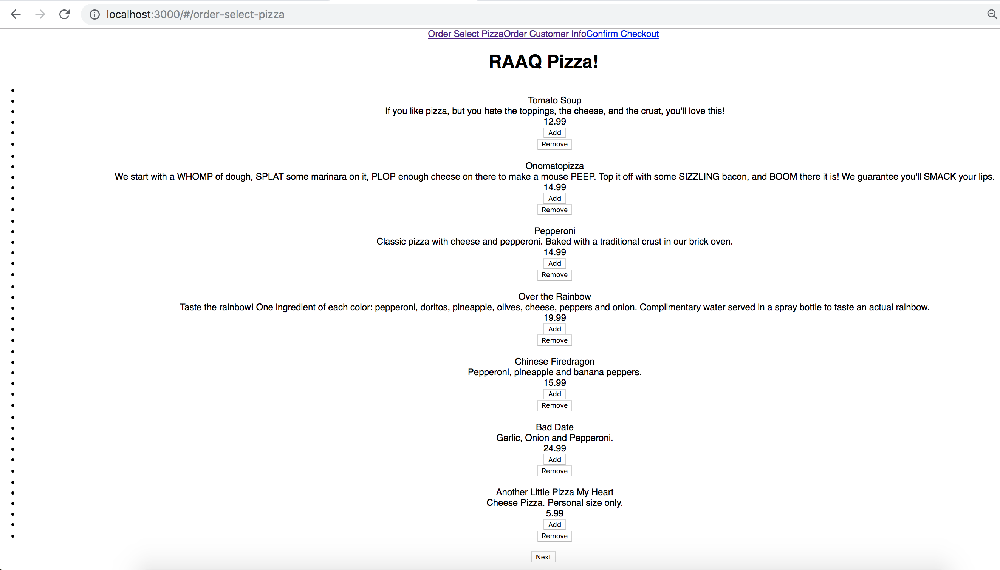
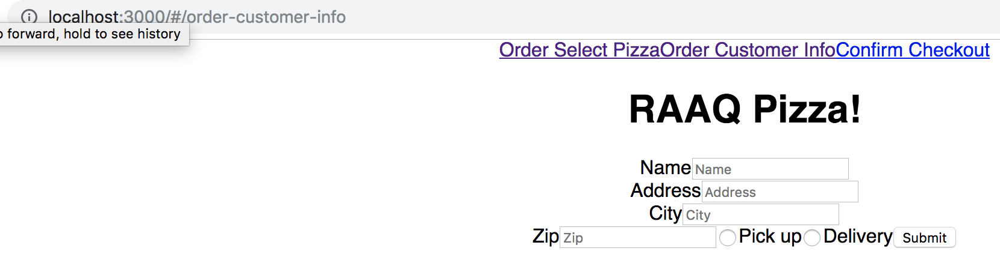
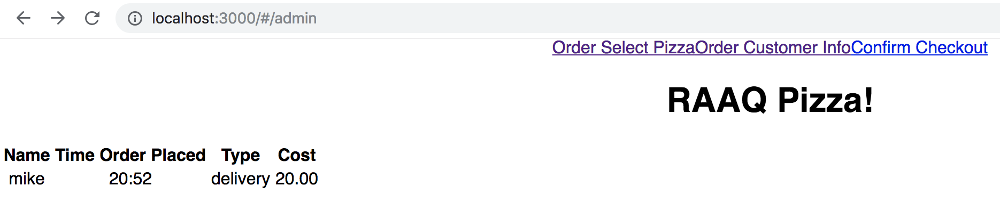

# RAAQ Pizza Parlour

## Prerequisites/Software Used

### Setup

- Node.js
- Postico
- Terminal
- React
- React-Redux

## Installing

- Download project
- `npm install`
- `createdb pizza_parlor`
- `npm run server`
- `npm run client`

## Screen Shot

### 1 Order Selection page

### 2 Customer Info page

### 3 Order Checkout page

### 4 Admin Page

## Documentation

- [Link to orginal assignment:](https://github.com/PrimeAcademy/redux-pizza-parlor)

## Completed Features

- Display a list of pizzas from the server via GET request.
- Add pizza to the cart/Remove pizza from cart.
- Created header component to display on every page. Conditionally renders the current cost of the cart depending on page.
- Page with a form to collect customer information.
- Created an admin page that displays order history from the server.

## Future Features

- CSS Styling
- Back button to previous page.
- Display list of pizzas for each order on the admin page.
- Add button on orders page to tack delivery status.
- create order details views.

## Deployment

- In the future we will deploy this to Heroku.

## Authors

- Mike Stockman
- Erin Olson
- Anthony Dunahee
- Shamarke Duale
- Dion Roloff
- Nick Neiret
- Max Todd

## Acknowledge 

- We would like to thank Chris Black, Luke Schlangen, and Dane aka DoctorHowser for the base assignment code.
- We would additionally like to thank Kris Szfranski and Ally Boyd.
- Thanks to our cohort, Zaurak aka ZauRAAQ.
- A special thanks to photographers on pexels for the images.

